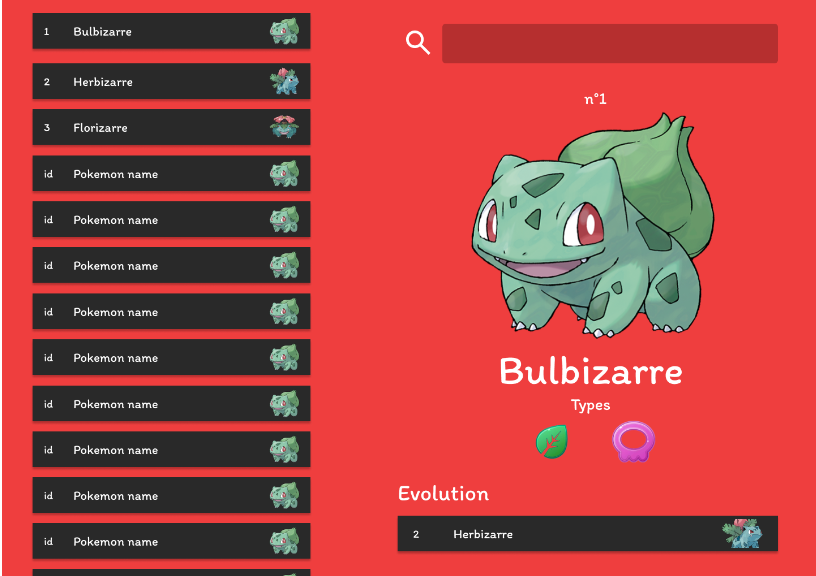

# Pokedex

Pour la récupération des pokémons, nous utiliserons l'API Pokebuild qui contient toutes les informations sur les pokémons.

Cette API REST est accessible à l'adresse : https://pokebuildapi.fr/api/v1

## Repo à forker

Forkez ce dépôt GitHub : https://github.com/CHAOUCHI/cdpi-dwwm-fetch-pokedex-project

## Cahier des charges

|Tâches|
|-|
|Lister tous les pokémons dans une liste défilante sur la gauche de l'écran.|
|Afficher les détails d'un pokémon sur la droite lorsque l'on *clique* sur un pokémon de la liste.|
|Afficher l'évolution du pokémon dans les détails et permettre, comme pour la liste de pokémons, le clic sur ce pokémon pour en voir les détails.|
|Mettre en place une barre de recherche qui affiche le pokémon tapé dans le menu détails sur la droite de l'écran.|

> Astuce : il est possible de stocker une donnée dans la balise HTML avec l'attribut `data-*`. Par exemple `
...
`
> https://developer.mozilla.org/fr/docs/Web/HTML/Global_attributes/data-*

<!-- ## Maquette

Voici la maquette Figma qui permet de récupérer facilement les couleurs hexadécimales et les assets si besoin.

Lien Figma : https://www.figma.com/file/eZkyaB5YcGxTsTgn4ZEcv2/Untitled?type=design&node-id=59%3A111&mode=design&t=QfImaCXxk6vqaSfd-1 -->

